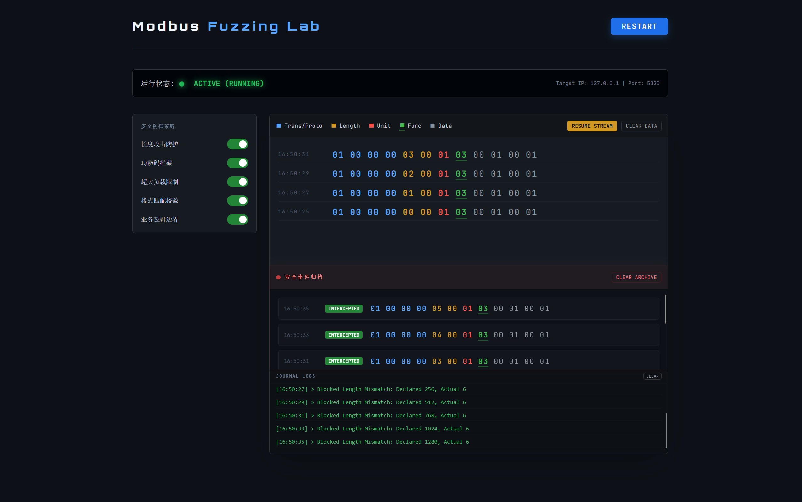

# 基于模糊测试的Modbus-TCP协议健壮性检测系统


技术架构:

- **前端:HTML5+js**
- **后端:Node.js**
- **模糊测试:python3.9+Boofuzz**

# 部署

## Node.js 环境

1. 安装Node.js:建议使用`version >= 18.x`,实验使用`v22.14.0`
2. 初始化依赖:
   在项目根目录下执行:

```shell
npm init -y
npm install express socket.io
```

3. 启动服务:

```shell
node monitor.js
```

此时服务将运行在`http://localhost:3000`

## Python 环境

[Boofuzz的Github地址](https://github.com/jtpereyda/boofuzz)

```shell
git clone https://github.com/jtpereyda/boofuzz.git
```

- 创建conda虚拟环境
  推荐:使用miniconda,占用空间小且完全够用

```shell
conda create --name <conda_envs_name> python=3.9 -y
```

- 安装必要的库

```python
# reqiurements.txt
argparse
boofuzz
```

```shell
pip install -r requirements.txt
```

- 运行
  - 提供运行参数:
  ```shell
    --mode:[
      "length", # 针对MBAP头的Length字段
      "func", # 针对功能码字段
      "payload", #针对超长载荷
      "format", 
      "bound", # 针对边界值
      "all" # 全部fuzzing
  ]
  --sleep: 发送数据包的时间间隔,便于观察数据包
  --ip: 目标ip
  --port: 目标端口
  ```
```shell
python fuzzing.py --mode length --ip 127.0.0.1 --port 5020 --sleep 2 
```

